# CampStation 아키텍처 다이어그램

## 🏗️ 시스템 아키텍처 개요

```mermaid
graph TB
    %% 사용자 레이어
    subgraph "사용자 레이어"
        U[사용자<br/>👤]
        A[관리자<br/>⚙️]
        O[소유자<br/>🏕️]
    end

    %% 프론트엔드 레이어
    subgraph "프론트엔드 (Next.js 15)"
        subgraph "UI 컴포넌트"
            P[페이지<br/>page.tsx]
            C[컴포넌트<br/>components/]
            L[레이아웃<br/>Layout.tsx]
        end

        subgraph "상태 관리"
            CTX[Context<br/>contexts/]
            H[Hooks<br/>hooks/]
        end

        subgraph "유틸리티"
            API[API 클라이언트<br/>lib/api/]
            UTIL[유틸리티<br/>utils/]
            TYPES[타입 정의<br/>types/]
        end
    end

    %% 백엔드 레이어
    subgraph "백엔드 (Spring Boot 3.5.6)"
        subgraph "컨트롤러 레이어"
            AC[AuthController]
            CC[CampgroundController]
            RC[ReservationController]
            UC[UserController]
            ADC[AdminController]
        end

        subgraph "서비스 레이어"
            AS[AuthService]
            CS[CampgroundService]
            RS[ReservationService]
            US[UserService]
            ADS[AdminService]
        end

        subgraph "리포지토리 레이어"
            AR[AuthRepository]
            CR[CampgroundRepository]
            RR[ReservationRepository]
            UR[UserRepository]
        end

        subgraph "보안 & 설정"
            JWT[JWT 인증<br/>security/]
            CFG[설정<br/>config/]
            VAL[유효성 검사<br/>validation/]
        end
    end

    %% 데이터베이스 레이어
    subgraph "데이터베이스"
        subgraph "PostgreSQL"
            PG[(사용자 데이터<br/>캠핑장 정보<br/>예약 데이터<br/>리뷰 데이터)]
        end

        subgraph "Redis"
            RED[(세션 캐시<br/>데이터 캐시)]
        end
    end

    %% 외부 서비스
    subgraph "외부 서비스"
        EMAIL[이메일 서비스<br/>📧]
        SMS[SMS 서비스<br/>💬]
        KAKAO[카카오맵<br/>🗺️]
        PAY[결제 서비스<br/>💳]
    end

    %% 연결선
    U --> P
    A --> P
    O --> P

    P --> C
    C --> L
    P --> CTX
    P --> H
    P --> API
    API --> UTIL
    API --> TYPES

    AC --> AS
    CC --> CS
    RC --> RS
    UC --> US
    ADC --> ADS

    AS --> AR
    CS --> CR
    RS --> RR
    US --> UR

    AS --> JWT
    CS --> CFG
    RS --> VAL

    AR --> PG
    CR --> PG
    RR --> PG
    UR --> PG

    AS --> RED
    CS --> RED

    ADS --> EMAIL
    ADS --> SMS
    C --> KAKAO
    RC --> PAY

    style U fill:#e1f5fe
    style A fill:#fff3e0
    style O fill:#e8f5e8
    style P fill:#f3e5f5
    style C fill:#f3e5f5
    style L fill:#f3e5f5
    style CTX fill:#fff8e1
    style H fill:#fff8e1
    style API fill:#e3f2fd
    style UTIL fill:#e3f2fd
    style TYPES fill:#e3f2fd
    style AC fill:#c8e6c9
    style CC fill:#c8e6c9
    style RC fill:#c8e6c9
    style UC fill:#c8e6c9
    style ADC fill:#c8e6c9
    style AS fill:#fff9c4
    style CS fill:#fff9c4
    style RS fill:#fff9c4
    style US fill:#fff9c4
    style ADS fill:#fff9c4
    style AR fill:#ffebee
    style CR fill:#ffebee
    style RR fill:#ffebee
    style UR fill:#ffebee
    style JWT fill:#f3e5f5
    style CFG fill:#f3e5f5
    style VAL fill:#f3e5f5
    style PG fill:#e8f5e8
    style RED fill:#fff8e1
    style EMAIL fill:#fce4ec
    style SMS fill:#fce4ec
    style KAKAO fill:#fce4ec
    style PAY fill:#fce4ec
```

## 📋 아키텍처 컴포넌트 상세 설명

### 🎯 사용자 역할
- **일반 사용자**: 캠핑장 검색, 예약, 리뷰 작성
- **관리자**: 시스템 관리, 사용자/캠핑장/예약/리뷰 관리
- **소유자**: 자신의 캠핑장 관리, 예약 현황 조회

### 🖥️ 프론트엔드 아키텍처 (Next.js 15 + App Router)

#### UI 레이어
- **페이지 (page.tsx)**: Next.js App Router 기반 라우팅
- **컴포넌트**: 재사용 가능한 UI 컴포넌트
- **레이아웃**: 공통 레이아웃 컴포넌트

#### 상태 관리
- **Context**: React Context를 활용한 전역 상태 관리
- **Hooks**: 커스텀 훅을 통한 로직 재사용

#### 유틸리티 레이어
- **API 클라이언트**: 백엔드 API 호출 및 데이터 관리
- **유틸리티**: 공통 함수 및 헬퍼
- **타입 정의**: TypeScript 타입 정의

### ⚙️ 백엔드 아키텍처 (Spring Boot 3.5.6)

#### 컨트롤러 레이어
- **AuthController**: 인증/인가 관련 API
- **CampgroundController**: 캠핑장 CRUD API
- **ReservationController**: 예약 관리 API
- **UserController**: 사용자 관리 API
- **AdminController**: 관리자 기능 API

#### 서비스 레이어
- 비즈니스 로직 처리
- 트랜잭션 관리
- 외부 서비스 연동

#### 리포지토리 레이어
- 데이터 액세스 객체
- JPA를 활용한 데이터베이스 연동

#### 보안 & 설정
- **JWT**: 토큰 기반 인증
- **설정**: 애플리케이션 설정 관리
- **유효성 검사**: 입력 데이터 검증

### 🗄️ 데이터베이스 레이어

#### PostgreSQL
- 사용자 정보, 캠핑장 정보, 예약 데이터, 리뷰 데이터 등 주요 데이터 저장

#### Redis
- 세션 관리 및 데이터 캐싱
- 성능 최적화를 위한 캐시 레이어

### 🌐 외부 서비스 연동
- **이메일 서비스**: 알림 및 인증 메일 발송
- **SMS 서비스**: SMS 알림 발송
- **카카오맵**: 지도 및 위치 서비스
- **결제 서비스**: 예약 결제 처리

## 🔄 데이터 플로우

1. **사용자 요청** → 프론트엔드 페이지
2. **API 호출** → 백엔드 컨트롤러
3. **비즈니스 로직** → 서비스 레이어
4. **데이터 조회/저장** → 리포지토리 → 데이터베이스
5. **응답 반환** → 프론트엔드 → 사용자

## 🛡️ 보안 아키텍처

- **JWT 토큰**: API 인증 및 인가
- **Spring Security**: 백엔드 보안 프레임워크
- **CORS 설정**: 크로스 오리진 요청 처리
- **입력 검증**: 데이터 유효성 검사

## 📊 모니터링 및 로깅

- **Spring Boot Actuator**: 애플리케이션 모니터링
- **로깅**: 구조화된 로그 관리
- **에러 처리**: 전역 예외 처리 및 사용자 친화적 에러 메시지

---

*최종 업데이트: 2025년 10월 3일*