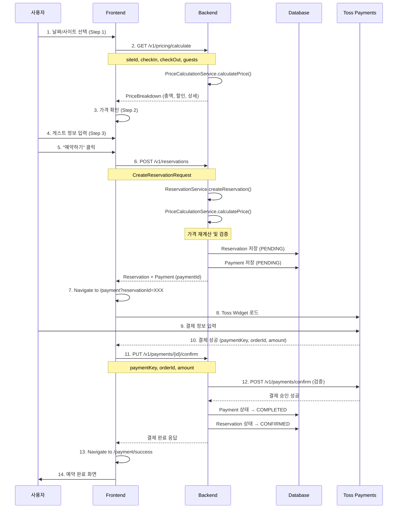
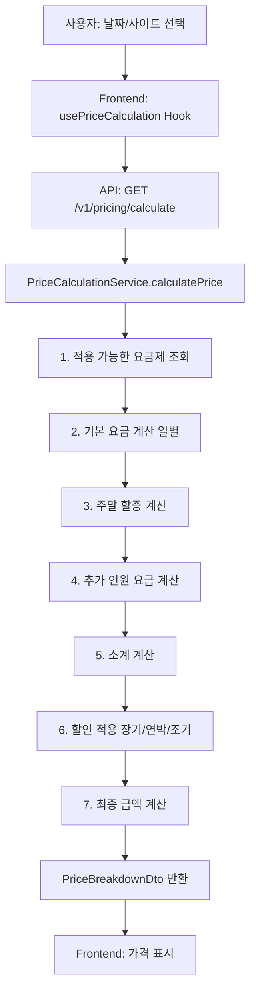
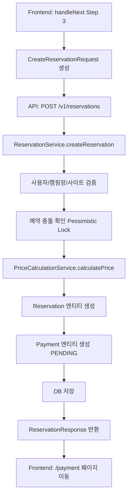

# 예약-결제 시스템 전체 Workflow 문서

> **작성일**: 2025-11-18  
> **목적**: 예약-결제 시스템의 전체 흐름을 문서화하고, 프론트엔드와 백엔드 간 일관성 확보  
> **상태**: 🔄 리팩토링 진행 중

---

## 📋 목차

1. [시스템 개요](#시스템-개요)
2. [현재 아키텍처](#현재-아키텍처)
3. [전체 Workflow](#전체-workflow)
4. [가격 계산 로직](#가격-계산-로직)
5. [예약 생성 프로세스](#예약-생성-프로세스)
6. [결제 프로세스](#결제-프로세스)
7. [문제점 및 개선 사항](#문제점-및-개선-사항)
8. [리팩토링 계획](#리팩토링-계획)

---

## 시스템 개요

### 주요 컴포넌트

```
┌─────────────────────────────────────────────────────────────┐
│                      Frontend (Next.js)                      │
├─────────────────────────────────────────────────────────────┤
│  1. 예약 플로우 (/reservations/new)                         │
│     - Step 1: 날짜/사이트 선택                               │
│     - Step 2: 가격 확인                                      │
│     - Step 3: 게스트 정보 입력                               │
│  2. 결제 페이지 (/payment)                                   │
│  3. 결제 성공 페이지 (/payment/success)                      │
└─────────────────────────────────────────────────────────────┘
                            ↓ HTTP API
┌─────────────────────────────────────────────────────────────┐
│                    Backend (Spring Boot)                     │
├─────────────────────────────────────────────────────────────┤
│  1. PricingController - 실시간 가격 계산                    │
│  2. ReservationController - 예약 생성/조회                  │
│  3. PaymentController - 결제 승인/검증                      │
│  4. PriceCalculationService - 가격 계산 로직                │
└─────────────────────────────────────────────────────────────┘
                            ↓
┌─────────────────────────────────────────────────────────────┐
│               외부 서비스 (Toss Payments)                    │
└─────────────────────────────────────────────────────────────┘
```

### 사용 기술

- **Frontend**: Next.js 15, React 19, TypeScript, React Query
- **Backend**: Spring Boot 3.x, Java 21, PostgreSQL
- **Payment**: Toss Payments API
- **State Management**: React Query (Server State), React Hooks (UI State)

---

## 현재 아키텍처

### Frontend 주요 파일

```
frontend/
├── app/reservations/new/
│   ├── page.tsx                          # 예약 메인 페이지
│   ├── hooks/
│   │   └── useReservationFlow.ts        # 예약 플로우 로직
│   └── components/
│       ├── Step1DateSite.tsx            # Step 1: 날짜/사이트 선택
│       ├── Step2PriceConfirm.tsx        # Step 2: 가격 확인
│       └── Step3GuestInfo.tsx           # Step 3: 게스트 정보
├── app/payment/
│   ├── page.tsx                          # 결제 페이지 (토스 위젯)
│   └── success/page.tsx                  # 결제 성공 페이지
├── hooks/
│   └── usePriceCalculation.ts           # 실시간 가격 계산 Hook
├── lib/api/
│   ├── pricing.ts                        # 가격 계산 API
│   ├── reservations.ts                   # 예약 API
│   └── payment.ts                        # 결제 API
└── types/domain/
    ├── reservation.ts                    # 예약 타입
    ├── pricing.ts                        # 가격 타입
    └── payment.ts                        # 결제 타입
```

### Backend 주요 파일

```
backend/src/main/java/com/campstation/camp/
├── pricing/
│   ├── controller/
│   │   └── PricingController.java       # GET /v1/pricing/calculate
│   ├── service/
│   │   └── PriceCalculationService.java # 가격 계산 비즈니스 로직
│   └── domain/
│       ├── SitePricing.java             # 요금제 엔티티
│       └── PricingRuleType.java         # 요금제 타입
├── reservation/
│   ├── controller/
│   │   └── ReservationController.java   # POST /v1/reservations
│   ├── service/
│   │   └── ReservationService.java      # 예약 생성 로직
│   ├── dto/
│   │   ├── CreateReservationRequest.java
│   │   ├── PriceBreakdownDto.java       # 가격 상세 내역
│   │   └── ReservationResponse.java
│   └── domain/
│       ├── Reservation.java             # 예약 엔티티
│       └── Payment.java                 # 결제 엔티티
└── payment/
    ├── controller/
    │   └── PaymentController.java       # PUT /v1/payments/{id}/confirm
    └── service/
        └── PaymentService.java          # 결제 승인 로직
```

---

## 전체 Workflow

### 1️⃣ 예약 생성 플로우 (Happy Path)



### 2️⃣ 가격 계산 플로우 (상세)



### 3️⃣ 예약 생성 플로우 (상세)



---

## 가격 계산 로직

### Backend: PriceCalculationService.java

```java
public PriceBreakdownDto calculatePrice(
    Site site,
    LocalDate checkInDate,
    LocalDate checkOutDate,
    int numberOfGuests
) {
    // 1. 활성 요금제 조회 (우선순위 순)
    List<SitePricing> pricings = pricingRepository
        .findBySiteIdOrderByPriorityDesc(site.getId())
        .stream()
        .filter(SitePricing::getIsActive)
        .toList();

    // 2. 기본 요금 계산 (일별)
    BigDecimal totalBasePrice = BigDecimal.ZERO;
    LocalDate currentDate = checkInDate;

    while (currentDate.isBefore(checkOutDate)) {
        SitePricing pricing = findApplicablePricing(pricings, currentDate);
        BigDecimal dailyPrice = calculateDailyPrice(pricing, currentDate);
        totalBasePrice = totalBasePrice.add(dailyPrice);
        currentDate = currentDate.plusDays(1);
    }

    // 3. 주말 할증 계산
    BigDecimal weekendSurcharge = calculateWeekendSurcharge(
        basePricing, checkInDate, checkOutDate
    );

    // 4. 추가 인원 요금 계산
    if (numberOfGuests > basePricing.getBaseGuests()) {
        int extraGuests = numberOfGuests - basePricing.getBaseGuests();
        BigDecimal extraGuestFee = basePricing.getExtraGuestFee()
            .multiply(BigDecimal.valueOf(extraGuests))
            .multiply(BigDecimal.valueOf(nights));
    }

    // 5. 소계 계산 (할인 적용 전) ✅ 수정됨
    BigDecimal subtotal = totalBasePrice
        .add(weekendSurcharge)
        .add(extraGuestFee);

    // 6. 할인 적용 (소계 기준) ✅ 수정됨
    // - 장기 숙박 할인
    // - 연박 할인
    // - 조기 예약 할인

    // 7. 최종 금액 계산
    breakdown.calculateTotalAmount();

    return breakdown;
}
```

### Frontend: usePriceCalculation.ts

```typescript
export function usePriceCalculation(params: CalculatePriceRequest | null) {
  return useQuery<PriceBreakdown>({
    queryKey: ["pricing", "calculate", params],
    queryFn: async () => {
      if (!params) throw new Error("파라미터 필요");
      return await pricingApi.calculate(params);
    },
    enabled: !!params && !!params.siteId && !!params.checkInDate,
    staleTime: 5 * 60 * 1000, // 5분 캐싱
  });
}
```

---

## 예약 생성 프로세스

### Frontend: useReservationFlow.ts

```typescript
const handleNext = async () => {
  if (step === 3) {
    const reservationData: CreateReservationRequest = {
      campgroundId,
      siteId: selectedSiteId!,
      checkInDate: formatDateToLocal(dateRange.start),
      checkOutDate: formatDateToLocal(dateRange.end),
      numberOfGuests: adults + children,
      paymentMethod,
      depositorName, // 계좌이체만
    };

    const reservation = await reservationApi.create(reservationData);

    // 결제 페이지로 이동
    router.push(
      `/payment?reservationId=${reservation.id}&paymentId=${paymentId}&...`
    );
  }
};
```

### Backend: ReservationService.java

```java
@Transactional
public ReservationResponse createReservation(
    CreateReservationRequest request,
    Long userId
) {
    // 1. 검증
    User user = userRepository.findById(userId).orElseThrow();
    Campground campground = campgroundRepository.findById(request.getCampgroundId()).orElseThrow();
    Site site = siteRepository.findById(request.getSiteId()).orElseThrow();

    // 2. 예약 충돌 확인 (Pessimistic Lock)
    List<Reservation> conflicts = reservationRepository
        .findConflictingReservationsForSiteWithLock(
            request.getSiteId(),
            request.getCheckInDate(),
            request.getCheckOutDate()
        );

    if (!conflicts.isEmpty()) {
        throw new ReservationConflictException(...);
    }

    // 3. 가격 계산 ✅ 동일한 PriceCalculationService 사용
    PriceBreakdownDto priceBreakdown = priceCalculationService.calculatePrice(
        site,
        request.getCheckInDate(),
        request.getCheckOutDate(),
        request.getNumberOfGuests()
    );

    // 4. Reservation 생성
    Reservation reservation = new Reservation();
    reservation.setUser(user);
    reservation.setTotalAmount(priceBreakdown.getTotalAmount());
    reservation.setPriceBreakdown(priceBreakdown); // JSONB 스냅샷
    reservation.setStatus(ReservationStatus.PENDING);

    // 5. Payment 생성 (PENDING)
    Payment payment = Payment.builder()
        .user(user)
        .reservationId(reservation.getId())
        .amount(reservation.getTotalAmount())
        .paymentMethod(request.getPaymentMethod())
        .status(PaymentStatus.PENDING)
        .build();

    // 6. 저장
    Reservation saved = reservationRepository.save(reservation);
    paymentRepository.save(payment);

    return convertToResponse(saved);
}
```

---

## 결제 프로세스

### 1. 결제 페이지 (/payment)

```typescript
// Frontend: app/payment/page.tsx
const PaymentPage = () => {
  const paymentWidget = usePaymentWidget(clientKey, ANONYMOUS);

  useEffect(() => {
    if (!paymentWidget) return;

    // Toss Payments Widget 렌더링
    paymentWidget.renderPaymentMethods({
      selector: "#payment-widget",
      variantKey: "DEFAULT",
    });
  }, [paymentWidget]);

  const handlePayment = async () => {
    await paymentWidget.requestPayment({
      orderId: `ORDER_${reservationId}_${Date.now()}`,
      orderName: `${campgroundName} - ${siteNumber}`,
      customerName: userName,
      successUrl: `${window.location.origin}/payment/success`,
      failUrl: `${window.location.origin}/payment/fail`,
    });
  };
};
```

### 2. 결제 성공 페이지 (/payment/success)

```typescript
// Frontend: app/payment/success/page.tsx
const PaymentSuccessPage = () => {
  const { paymentKey, orderId, amount } = searchParams;

  useEffect(() => {
    confirmPayment();
  }, []);

  const confirmPayment = async () => {
    // Backend에 결제 승인 요청
    await paymentApi.confirm(paymentId, {
      paymentKey,
      orderId,
      amount: Number(amount),
    });

    // 성공 시 예약 상세 페이지로 이동
    router.push(`/reservations/${reservationId}`);
  };
};
```

### 3. 결제 승인 (Backend)

```java
// Backend: PaymentController.java
@PutMapping("/payments/{paymentId}/confirm")
public ResponseEntity<?> confirmPayment(
    @PathVariable Long paymentId,
    @RequestBody ConfirmPaymentRequest request
) {
    // 1. Payment 조회
    Payment payment = paymentRepository.findById(paymentId).orElseThrow();

    // 2. 금액 검증
    if (!payment.getAmount().equals(request.getAmount())) {
        throw new PaymentAmountMismatchException();
    }

    // 3. Toss Payments API 호출 (검증)
    TossPaymentResponse tossResponse = tossPaymentsService.confirm(
        request.getPaymentKey(),
        request.getOrderId(),
        request.getAmount()
    );

    // 4. Payment 상태 업데이트
    payment.setStatus(PaymentStatus.COMPLETED);
    payment.setTransactionId(tossResponse.getTransactionId());
    payment.setApprovedAt(LocalDateTime.now());

    // 5. Reservation 상태 업데이트
    Reservation reservation = reservationRepository
        .findById(payment.getReservationId())
        .orElseThrow();
    reservation.setStatus(ReservationStatus.CONFIRMED);

    // 6. 저장
    paymentRepository.save(payment);
    reservationRepository.save(reservation);

    return ResponseEntity.ok(payment);
}
```

---

## 문제점 및 개선 사항

### 🐛 발견된 문제

#### 1. ~~가격 계산 불일치~~ ✅ **해결됨**

**문제**:

- 할인이 기본 요금(basePrice)에만 적용되어 주말 할증이 할인에서 제외됨
- 프론트엔드: 180,500원 / 백엔드: 260,500원

**해결**:

- 할인을 소계(기본 요금 + 주말 할증 + 추가 인원)에 적용하도록 수정
- `PriceCalculationService.java` 수정 완료

#### 2. 가격 데이터 전달 불일치 ⚠️ **진행 중**

**문제**:

```typescript
// Frontend: CreateReservationRequest에 priceBreakdown 없음
const reservationData: CreateReservationRequest = {
  campgroundId,
  siteId,
  checkInDate,
  checkOutDate,
  numberOfGuests,
  paymentMethod,
  // ❌ priceBreakdown 전송하지 않음
};
```

**영향**:

- 백엔드가 가격을 재계산하므로 이론적으로는 문제 없음
- 하지만 프론트엔드 계산값과 백엔드 계산값이 다를 경우 사용자 혼란

**개선 방안**:

1. **옵션 A**: 프론트엔드에서 계산한 priceBreakdown을 백엔드로 전송
   - 백엔드는 검증만 수행
   - 불일치 시 에러 반환
2. **옵션 B** ✅ **권장**: 현재 방식 유지 + 검증 강화
   - 백엔드에서만 가격 계산 (Single Source of Truth)
   - 프론트엔드는 미리보기용으로만 사용
   - 예약 생성 시 재계산하여 DB 저장

#### 3. 결제 페이지 URL 파라미터 과다 ⚠️

**문제**:

```typescript
// 너무 많은 파라미터를 URL로 전달
const queryParams = new URLSearchParams({
  reservationId,
  paymentId,
  paymentMethod,
  siteNumber,
  sitePrice,
  checkIn,
  checkOut,
  nights,
  adults,
  children,
  totalAmount,
  priceBreakdown: JSON.stringify(priceBreakdown), // 너무 큼!
});
```

**개선 방안**:

- 최소한의 파라미터만 전달 (reservationId, paymentId)
- 나머지는 API로 조회

#### 4. 결제 승인 시 금액 검증 로직 개선 필요 ⚠️

**현재**:

```java
// 단순 금액 일치만 확인
if (!payment.getAmount().equals(request.getAmount())) {
    throw new PaymentAmountMismatchException();
}
```

**개선**:

- PriceBreakdown 전체 검증
- 할인 조작 방지
- 요금제 변경 감지

---

## 리팩토링 계획

### Phase 1: 가격 계산 로직 통일 ✅ **완료**

- [x] 백엔드: 할인을 소계 기준으로 계산하도록 수정
- [x] 문서화: price-calculation-fix.md 작성
- [x] 배포: 백엔드 재빌드 완료

### Phase 2: 예약 생성 프로세스 개선 🔄 **진행 중**

#### 2.1 백엔드 검증 로직 강화

```java
@Transactional
public ReservationResponse createReservation(
    CreateReservationRequest request,
    Long userId
) {
    // 기존 로직...

    // ✅ 가격 재계산 및 검증 강화
    PriceBreakdownDto calculatedPrice = priceCalculationService.calculatePrice(
        site, request.getCheckInDate(), request.getCheckOutDate(), request.getNumberOfGuests()
    );

    // ✅ 프론트엔드에서 전송한 금액과 비교 (선택적)
    if (request.getExpectedAmount() != null) {
        if (!calculatedPrice.getTotalAmount().equals(request.getExpectedAmount())) {
            log.warn("Price mismatch: expected={}, calculated={}",
                request.getExpectedAmount(), calculatedPrice.getTotalAmount());
            // 옵션 1: 에러 throw
            // 옵션 2: 경고 로그만 남기고 계산값 사용
        }
    }

    // 계산된 가격으로 예약 생성
    reservation.setTotalAmount(calculatedPrice.getTotalAmount());
    reservation.setPriceBreakdown(calculatedPrice);

    // ...
}
```

#### 2.2 프론트엔드 개선

```typescript
// ✅ 명확한 가격 출처 표시
const handleNext = async () => {
  // 실시간 계산된 가격 사용
  const expectedAmount = priceBreakdown?.totalAmount;

  const reservationData: CreateReservationRequest = {
    campgroundId,
    siteId: selectedSiteId!,
    checkInDate,
    checkOutDate,
    numberOfGuests: adults + children,
    paymentMethod,
    expectedAmount, // 검증용
  };

  try {
    const reservation = await reservationApi.create(reservationData);

    // ✅ 금액 불일치 체크
    if (Math.abs(reservation.totalAmount - expectedAmount) > 100) {
      console.error("Price mismatch detected!");
      // 사용자에게 알림
    }
  } catch (error) {
    // 에러 처리
  }
};
```

### Phase 3: 결제 프로세스 개선

#### 3.1 URL 파라미터 최소화

```typescript
// Before
router.push(`/payment?${queryParams}`); // 10+ 파라미터

// After ✅
router.push(`/payment?reservationId=${id}&paymentId=${pid}`);
```

#### 3.2 결제 페이지에서 API 조회

```typescript
// app/payment/page.tsx
const PaymentPage = () => {
  const { reservationId, paymentId } = searchParams;

  // ✅ 예약 정보 조회
  const { data: reservation } = useReservation(reservationId);
  const { data: payment } = usePayment(paymentId);

  // URL 파라미터 대신 API 응답 사용
  const { campgroundName, siteNumber, totalAmount } = reservation;
};
```

#### 3.3 결제 승인 검증 강화

```java
@Transactional
public PaymentResponse confirmPayment(
    Long paymentId,
    ConfirmPaymentRequest request
) {
    Payment payment = paymentRepository.findById(paymentId).orElseThrow();
    Reservation reservation = reservationRepository
        .findById(payment.getReservationId())
        .orElseThrow();

    // ✅ 가격 재계산 및 검증
    Site site = reservation.getSite();
    PriceBreakdownDto currentPrice = priceCalculationService.calculatePrice(
        site,
        reservation.getCheckInDate(),
        reservation.getCheckOutDate(),
        reservation.getNumberOfGuests()
    );

    // ✅ 요금제 변경 감지
    if (!currentPrice.getTotalAmount().equals(reservation.getTotalAmount())) {
        log.warn("Pricing changed between reservation and payment!");
        // 예약 시점 가격으로 진행 (저장된 priceBreakdown 사용)
    }

    // ✅ 금액 검증
    if (!payment.getAmount().equals(request.getAmount())) {
        throw new PaymentAmountMismatchException();
    }

    // Toss Payments 승인 요청
    TossPaymentResponse tossResponse = tossPaymentsService.confirm(
        request.getPaymentKey(),
        request.getOrderId(),
        request.getAmount()
    );

    // 상태 업데이트
    payment.setStatus(PaymentStatus.COMPLETED);
    reservation.setStatus(ReservationStatus.CONFIRMED);

    return convertToResponse(payment);
}
```

### Phase 4: 에러 처리 개선

#### 4.1 Frontend 에러 처리

```typescript
// hooks/useReservationFlow.ts
const handleNext = async () => {
  try {
    const reservation = await reservationApi.create(reservationData);

    // 성공
    router.push(`/payment?...`);
  } catch (error) {
    // ✅ 구체적인 에러 처리
    if (error.code === "RESERVATION_CONFLICT") {
      alert("선택하신 날짜에 이미 예약이 있습니다. 다른 날짜를 선택해주세요.");
      setStep(1); // Step 1로 돌아가기
    } else if (error.code === "PRICE_MISMATCH") {
      alert("가격이 변경되었습니다. 다시 확인해주세요.");
      // 가격 재계산
      refetch();
    } else {
      alert("예약 생성 중 오류가 발생했습니다.");
    }
  } finally {
    setIsCreatingReservation(false);
  }
};
```

#### 4.2 Backend 에러 응답 표준화

```java
// Exception Handler
@ExceptionHandler(ReservationConflictException.class)
public ResponseEntity<ErrorResponse> handleReservationConflict(
    ReservationConflictException ex
) {
    ErrorResponse error = ErrorResponse.builder()
        .code("RESERVATION_CONFLICT")
        .message("선택하신 날짜에 이미 예약이 있습니다.")
        .details(Map.of(
            "siteId", ex.getSiteId(),
            "checkInDate", ex.getCheckInDate(),
            "checkOutDate", ex.getCheckOutDate()
        ))
        .timestamp(LocalDateTime.now())
        .build();

    return ResponseEntity.status(HttpStatus.CONFLICT).body(error);
}
```

### Phase 5: 통합 테스트

#### 5.1 E2E 테스트 시나리오

```typescript
// e2e/reservation-flow.spec.ts
describe("Reservation Flow", () => {
  test("전체 예약-결제 플로우", async ({ page }) => {
    // 1. 캠핑장 선택
    await page.goto("/campgrounds/1");

    // 2. 날짜 선택
    await page.click('[data-testid="reserve-button"]');
    await selectDateRange(page, "2025-12-20", "2025-12-22");

    // 3. 사이트 선택
    await page.click('[data-testid="site-A01"]');
    await page.click('[data-testid="next-button"]');

    // 4. 가격 확인
    const price = await page.textContent('[data-testid="total-amount"]');
    expect(price).toContain("203,000원");
    await page.click('[data-testid="next-button"]');

    // 5. 게스트 정보 입력
    await page.click('[data-testid="payment-method-card"]');
    await page.click('[data-testid="reserve-button"]');

    // 6. 결제 페이지
    await expect(page).toHaveURL(/\/payment/);

    // 7. Toss 위젯 (Mock)
    await mockTossPayment(page);

    // 8. 결제 성공
    await expect(page).toHaveURL(/\/payment\/success/);

    // 9. 예약 확인
    const confirmationNumber = await page.textContent(
      '[data-testid="reservation-id"]'
    );
    expect(confirmationNumber).toBeDefined();
  });
});
```

---

## 체크리스트

### ✅ 완료된 항목

- [x] 가격 계산 로직 수정 (할인을 소계 기준으로)
- [x] 백엔드 재빌드 및 배포
- [x] 문제 분석 문서 작성 (price-calculation-mismatch.md)
- [x] 해결 방법 문서 작성 (price-calculation-fix.md)

### 🔄 진행 중

- [ ] Workflow 문서 작성 (이 문서)
- [ ] 예약 생성 프로세스 개선
- [ ] 결제 프로세스 개선
- [ ] 에러 처리 개선

### 📋 예정

- [ ] 통합 테스트 작성
- [ ] E2E 테스트 작성
- [ ] 성능 최적화
- [ ] 모니터링 대시보드

---

## 다음 단계

1. ✅ **가격 계산 로직 통일** (완료)
2. 🔄 **예약 생성 프로세스 검증** (진행 중)
   - CreateReservationRequest 타입 확인
   - 백엔드 검증 로직 강화
   - 프론트엔드 에러 처리 개선
3. 📋 **결제 프로세스 개선**
   - URL 파라미터 최소화
   - API 조회 방식으로 전환
   - 결제 승인 검증 강화
4. 📋 **통합 테스트 작성**
5. 📋 **최종 검증 및 문서 업데이트**

---

**작성자**: GitHub Copilot  
**최종 수정**: 2025-11-18  
**버전**: 1.0
